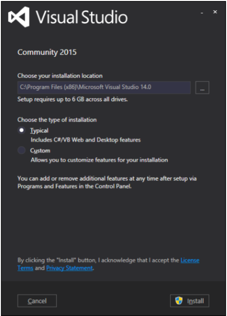
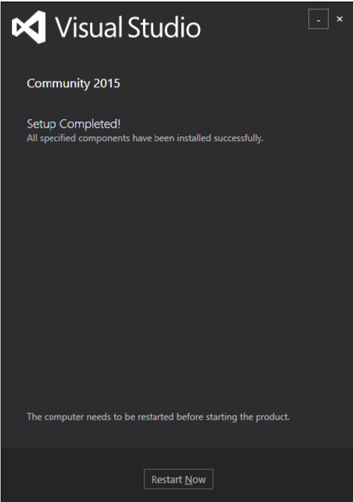
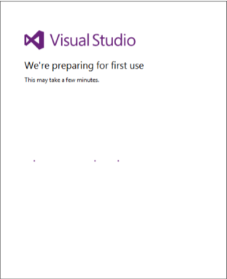
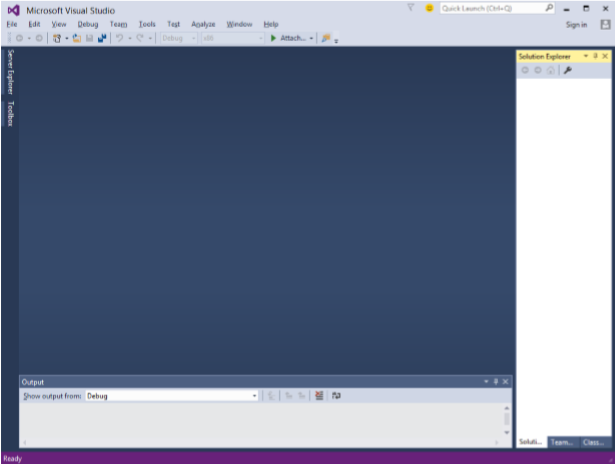

# WPF - Environment Setup
Microsoft provides two important tools for WPF application development.

   * Visual Studio
   * Expression Blend

Both the tools can create WPF projects, but the fact is that Visual Studio is used more by developers, while Blend is used more often by designers. For this tutorial, we will mostly be using Visual Studio.

## Installation
Microsoft provides a free version of Visual Studio which can be downloaded from [VisualStudio](https://www.visualstudio.com/en-us/downloads/download-visual-studio-vs.aspx) .

Download the files and follow the steps given below to set up WPF application development environment on your system.

   * After the download is complete, run the **installer**. The following dialog will be displayed.

   * Click the **Install** button and it will start the installation process.

   * Once the installation process is completed successfully, you will get to see the following dialog box.

   * Close this dialog box and restart your computer if required.
   * Now open Visual Studio from the Start Menu which will open the following dialog box.

   * Once all is done, you will see the main window of Visual Studio.

You are now ready to build your first WPF application.

[Previous Page](../wpf/wpf_overview.md) [Next Page](../wpf/wpf_hello_world.md) 
