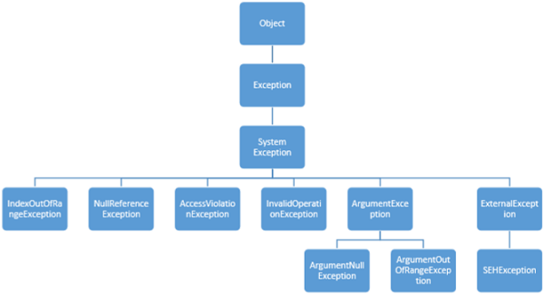
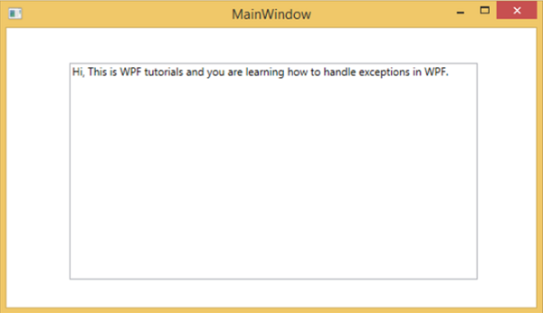
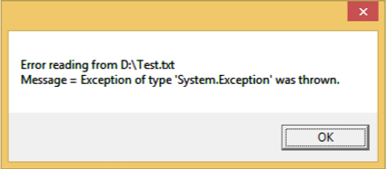

# WPF - Exception Handling
An exception is any error condition or an unexpected behavior that is encountered during the execution of a program. Exceptions can be raised due to many reasons, some of them are as follows −

   * Fault in your code or in code that you call (such as a shared library),
   * Unavailable operating system resources,
   * Unexpected conditions that a common language runtime encounters (such as code that cannot be verified)

## Syntax
Exceptions have the ability to transfer the flow of a program from one part to another. In .NET framework, exception handling has the following four keywords −

   * **try** − In this block, the program identifies a certain condition which raises some exception.
   * **catch** − The catch keyword indicates the catching of an exception. A **try** block is followed by one or more **catch** blocks to catch an exception with an exception handler at the place in a program where you want to handle the problem.
   * **finally** − The finally block is used to execute a given set of statements, whether an exception is thrown or not thrown. For example, if you open a file, it must be closed whether an exception is raised or not.
   * **throw** − A program throws an exception when a problem shows up. This is done using a throw keyword.

The syntax to use these four keywords goes as follows −

```
try { 
   ///This will still trigger the exception 
} 
catch (ExceptionClassName e) { 
   // error handling code 
} 
catch (ExceptionClassName e) { 
   // error handling code
}
catch (ExceptionClassName e) { 
   // error handling code 
} 
finally { 
   // statements to be executed 
}
```
Multiple catch statements are used in those cases where a try block can raise more than one exception depending on the situation of a program flow.

## Hierarchy
Almost all the exception classes in the .NET framework are directly or indirectly derived from the Exception class. The most important exception classes derived from the Exception class are −

   * **ApplicationException class** − It supports exceptions which are generated by programs. When developer want to define exception then class should be derived from this class.
   * **SystemException class** − It is the base class for all predefined runtime system exceptions. The following hierarchy shows the standard exceptions provided by the runtime.



The following table lists the standard exceptions provided by the runtime and the conditions under which you should create a derived class.

### Example
Let’s take a simple example to understand the concept better. Start by creating a new WPF project with the name **WPFExceptionHandling**.

Drag one textbox from the toolbox to the design window. The following XAML code creates a textbox and initializes it with some properties.

```
<Window x:Class = "WPFExceptionHandling.MainWindow" 
   xmlns = "http://schemas.microsoft.com/winfx/2006/xaml/presentation"
   xmlns:x = "http://schemas.microsoft.com/winfx/2006/xaml"
   xmlns:d = "http://schemas.microsoft.com/expression/blend/2008"
   xmlns:mc = "http://schemas.openxmlformats.org/markup-compatibility/2006" 
   xmlns:local = "clr-namespace:WPFExceptionHandling"
   mc:Ignorable = "d" 
   Title = "MainWindow" Height = "350" Width = "604">
	
   <Grid> 
      <TextBox x:Name = "textBox" HorizontalAlignment = "Left"
         Height = "241" Margin = "70,39,0,0" TextWrapping = "Wrap" 
         VerticalAlignment = "Top" Width = "453"/> 
   </Grid> 
	
</Window>
```
Here is the file reading with exception handling in C#.

```
using System; 
using System.IO; 
using System.Windows;

namespace WPFExceptionHandling { 

   public partial class MainWindow : Window { 
	
      public MainWindow() { 
         InitializeComponent(); 
         ReadFile(0); 
      }
		
      void ReadFile(int index) { 
         string path = @"D:\Test.txt"; 
         StreamReader file = new StreamReader(path); 
         char[] buffer = new char[80]; 
			
         try { 
            file.ReadBlock(buffer, index, buffer.Length); 
            string str = new string(buffer); 
            str.Trim(); 
            textBox.Text = str; 
         }
         catch (Exception e) {
            MessageBox.Show("Error reading from "+ path + "\nMessage = "+ e.Message);
         } 
         finally { 
            if (file != null) { 
               file.Close(); 
            } 
         } 
      } 
   } 
}
```
When you compile and execute the above code, it will produce the following window in which a text is displayed inside the textbox.



When there is an exception raised or you throw it manually (as in the following code), then it will show a message box with error.

```
using System; 
using System.IO; 
using System.Windows;

namespace WPFExceptionHandling {
 
   public partial class MainWindow : Window {
	
      public MainWindow() { 
         InitializeComponent(); 
         ReadFile(0); 
      } 
		
      void ReadFile(int index) { 
         string path = @"D:\Test.txt"; 
         StreamReader file = new StreamReader(path); 
         char[] buffer = new char[80]; 
			
         try { 
            file.ReadBlock(buffer, index, buffer.Length); 
            string str = new string(buffer); 
            throw new Exception(); 
            str.Trim(); 
            textBox.Text = str; 
         }
         catch (Exception e) { 
            MessageBox.Show("Error reading from "+ path + "\nMessage = "+ e.Message); 
         } 
         finally { 
            if (file != null) { 
               file.Close(); 
            } 
         } 
      } 
   } 
}
```
When an exception is raised while executing the above code, it will display the following message.



We recommend that you execute the above code and experiment with its features.


[Previous Page](../wpf/wpf_custom_controls.md) [Next Page](../wpf/wpf_localization.md) 
