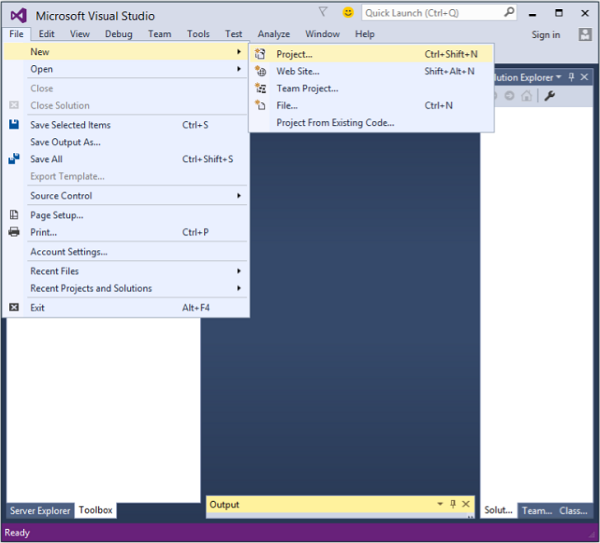
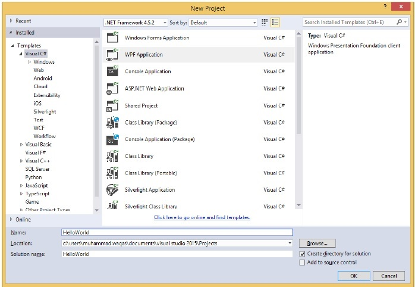
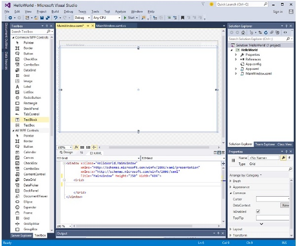
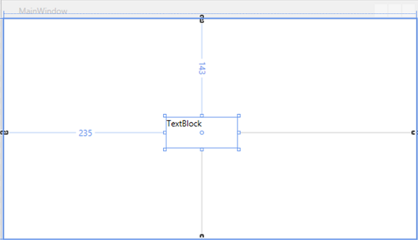
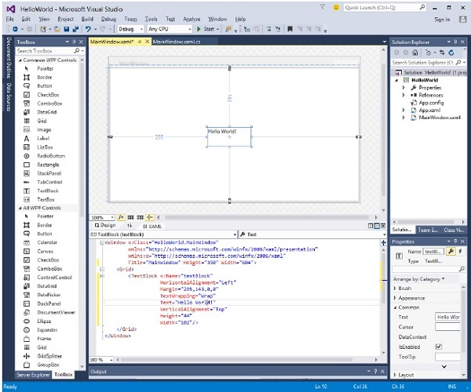
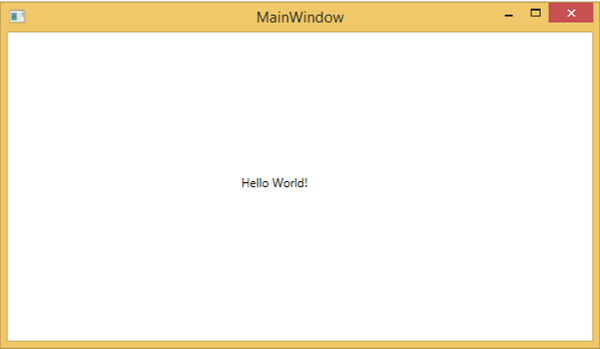

# WPF - Hello World
In this chapter, we will develop a simple Hello World WPF application. So let’s start the simple implementation by following the steps given below.

   * Click on File &gt; New &gt; Project menu option.



   * The following dialog box will be displayed.



   * Under Templates, select Visual C# and in the middle panel, select WPF Application.
   * Give the project a name. Type **HelloWorld** in the name field and click the OK button.
   * By default, two files are created, one is the **XAML** file (mainwindow.xaml) and the other one is the **CS** file (mainwindow.cs)
   * On mainwindow.xaml, you will see two sub-windows, one is the **design window** and the other one is the **source** (XAML) **window**.
   * In WPF application, there are two ways to design an UI for your application. One is to simply drag and drop UI elements from the toolbox to the Design Window. The second way is to design your UI by writing XAML tags for UI elements. Visual Studio handles XAML tags when drag and drop feature is used for UI designing.
   * In mainwindow.xaml file, the following XAML tags are written by default.

```
<Window x:Class = "HelloWorld.MainWindow" 
   xmlns = "http://schemas.microsoft.com/winfx/2006/xaml/presentation" 
   xmlns:x = "http://schemas.microsoft.com/winfx/2006/xaml"
   Title = "MainWindow" Height = "350" Width = "604">
	
   <Grid> 
   </Grid> 
	
</Window>
```
   * By default, a Grid is set as the first element after page.
   * Let’s go to the toolbox and drag a TextBlock to the design window.



   * You will see the TextBlock on the design window.



   * When you look at the source window, you will see that Visual Studio has generated the XAML code of the TextBlock for you.
   * Let’s change the Text property of TextBlock in XAML code from TextBlock to Hello World.

```
<Window x:Class = "HelloWorld.MainWindow" 
   xmlns = "http://schemas.microsoft.com/winfx/2006/xaml/presentation" 
   xmlns:x = "http://schemas.microsoft.com/winfx/2006/xaml"
   Title = "MainWindow" Height = "350" Width = "604"> 
	
   <Grid> 
      <TextBlock x:Name = "textBlock" HorizontalAlignment = "Left"
         Margin = "235,143,0,0" TextWrapping = "Wrap" Text = "Hello World!"
         VerticalAlignment = "Top" Height = "44" Width = "102" /> 
   </Grid> 
	
</Window>
```
   * Now, you will see the change on the Design Window as well.



When the above code is compiled and executed, you will see the following window.



Congratulations! You have designed and created your first WPF application.


[Previous Page](../wpf/wpf_environment_setup.md) [Next Page](../wpf/wpf_xaml_overview.md) 
