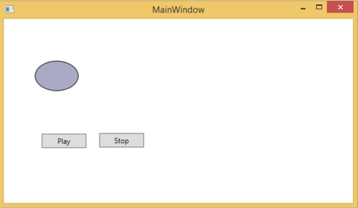
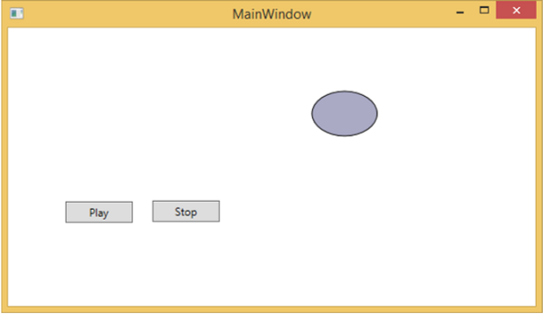
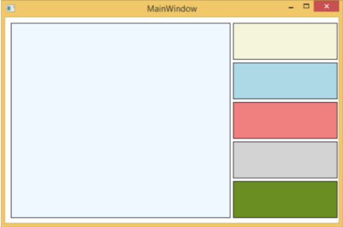
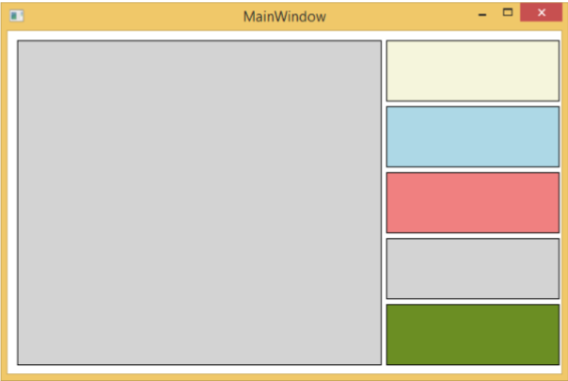

# WPF - Interaction
In WPF, an interaction shows how a view interacts with controls located in that view. The most commonly known interactions are of two types −

   * Behaviors
   * Drag and Drop

## Behaviors
Behaviors were introduced with Expression Blend 3 which can encapsulate some of the functionality into a reusable component. To add additional behaviors, you can attach these components to the controls. Behaviors provide more flexibility to design complex user interactions easily.

Let’s take a look at a simple example in which a ControlStoryBoardAction behavior is attached to controls.

   * Create a new WPF project with the name WPFBehavior.
   * The following XAML code creates an ellipse and two buttons to control the movement of the ellipse.

```
<Window 
   xmlns = "http://schemas.microsoft.com/winfx/2006/xaml/presentation" 
   xmlns:x = "http://schemas.microsoft.com/winfx/2006/xaml" 
   xmlns:d = "http://schemas.microsoft.com/expression/blend/2008" 
   xmlns:mc = "http://schemas.openxmlformats.org/markup-compatibility/2006" 
   xmlns:local = "clr-namespace:WPFBehaviors" 
   xmlns:i = "http://schemas.microsoft.com/expression/2010/interactivity" 
   xmlns:ei = "http://schemas.microsoft.com/expression/2010/interactions" 
   x:Class = "WPFBehaviors.MainWindow" 
   mc:Ignorable = "d" Title = "MainWindow" Height = "350" Width = "604">
	
   <Window.Resources> 
      <Storyboard x:Key = "Storyboard1" RepeatBehavior = "Forever" AutoReverse = "True"> 
		
         <DoubleAnimationUsingKeyFrames Storyboard.TargetProperty =
            "(UIElement.RenderTransform).(TransformGroup.Children )[3].(TranslateTransform.X)"
            Storyboard.TargetName = "ellipse"> 
            <EasingDoubleKeyFrame KeyTime = "0:0:1" Value = "301.524"/> 
            <EasingDoubleKeyFrame KeyTime = "0:0:2" Value = "2.909"/> 
         </DoubleAnimationUsingKeyFrames>
			
         <DoubleAnimationUsingKeyFrames Storyboard.TargetProperty = 
            "(UIElement.RenderTransform).(TransformGroup.Children )[3].(TranslateTransform.Y)"
            Storyboard.TargetName = "ellipse"> 
            <EasingDoubleKeyFrame KeyTime = "0:0:1" Value = "-0.485"/> 
            <EasingDoubleKeyFrame KeyTime = "0:0:2" Value = "0"/> 
         </DoubleAnimationUsingKeyFrames> 
			
         <ObjectAnimationUsingKeyFrames Storyboard.TargetProperty = "(ContentControl.Content)"
            Storyboard.TargetName = "button"> 
            <DiscreteObjectKeyFrame KeyTime = "0" Value = "Play"/> 
         </ObjectAnimationUsingKeyFrames>
			
         <ObjectAnimationUsingKeyFrames Storyboard.TargetProperty = "(ContentControl.Content)"
            Storyboard.TargetName = "button1"> 
            <DiscreteObjectKeyFrame KeyTime = "0" Value = "Stop"/> 
            <DiscreteObjectKeyFrame KeyTime = "0:0:2" Value = "Stop"/> 
         </ObjectAnimationUsingKeyFrames> 
      </Storyboard> 
   </Window.Resources> 
	
   <Window.Triggers> 
      <EventTrigger RoutedEvent = "FrameworkElement.Loaded"> 
         <BeginStoryboard Storyboard = "{StaticResource Storyboard1}"/> 
      </EventTrigger> 
   </Window.Triggers> 
	
   <Grid> 
      <Ellipse x:Name = "ellipse" Fill = "#FFAAAAC5" HorizontalAlignment = "Left"
         Height = "50.901" Margin = "49.324,70.922,0,0" Stroke = "Black"
         VerticalAlignment = "Top" Width = "73.684" RenderTransformOrigin = "0.5,0.5"> 
         <Ellipse.RenderTransform> 
            <TransformGroup> 
               <ScaleTransform/> 
               <SkewTransform/> 
               <RotateTransform/> 
               <TranslateTransform/> 
            </TransformGroup> 
         </Ellipse.RenderTransform> 
      </Ellipse>
		
      <Button x:Name = "button" Content = "Play" HorizontalAlignment = "Left" Height = "24.238"
         Margin = "63.867,0,0,92.953" VerticalAlignment = "Bottom" Width = "74.654"> 
         <i:Interaction.Triggers> 
            <i:EventTrigger EventName = "Click"> 
               <ei:ControlStoryboardAction Storyboard = "{StaticResource Storyboard1}"/> 
            </i:EventTrigger> 
         </i:Interaction.Triggers> 
      </Button>
		
      <Button x:Name = "button1" Content = "Stop" HorizontalAlignment = "Left" Height = "24.239"
         Margin = "160.82,0,0,93.922" VerticalAlignment = "Bottom" Width = "75.138"> 
         <i:Interaction.Triggers> 
            <i:EventTrigger EventName = "Click"> 
               <ei:ControlStoryboardAction ControlStoryboardOption = "Stop"
                  Storyboard = "{StaticResource Storyboard1}"/> 
            </i:EventTrigger> 
         </i:Interaction.Triggers> 
      </Button> 
		
   </Grid> 
</Window>
```
When you compile and execute the above code, it will produce the following window which contains an ellipse and two buttons.



When you press the play button, it will start moving from left to right and then will return to its original position. The stop button will stop the movement the ellipse.



## Drag and Drop
Drag and Drop on user interface can significantly advance the efficiency and productivity of the application. There are very few applications in which drag and drop features are used because people think it is difficult to implement. To an extent, it is difficult to handle a drag and drop feature, but in WPF, you can handle it quite easily.

Let’s take a simple example to understand how it works. We will create an application wherein you can drag and drop color from one rectangle to another.

   * Create a new WPF project with the name WPFDragAndDrop.
   * Drag five rectangles to the design window and set the properties as shown in the following XAML file.

```
<Window x:Class = "WPFDragAndDrop.MainWindow" 
   xmlns = "http://schemas.microsoft.com/winfx/2006/xaml/presentation" 
   xmlns:x = "http://schemas.microsoft.com/winfx/2006/xaml" 
   xmlns:d = "http://schemas.microsoft.com/expression/blend/2008" 
   xmlns:mc = "http://schemas.openxmlformats.org/markup-compatibility/2006" 
   xmlns:local = "clr-namespace:WPFDragAndDrop" 
   mc:Ignorable = "d" Title = "MainWindow" Height = "402.551" Width = "604"> 
	
   <Grid> 
      <Rectangle Name = "Target" Fill = "AliceBlue" HorizontalAlignment = "Left"  
         Height = "345" Margin = "10,10,0,0" Stroke = "Black"  
         VerticalAlignment = "Top" Width = "387" AllowDrop = "True" Drop = "Target_Drop"/> 
			
      <Rectangle Fill = "Beige" HorizontalAlignment = "Left" Height = "65"  
         Margin = "402,10,0,0" Stroke = "Black" VerticalAlignment = "Top"  
         Width = "184" MouseLeftButtonDown = "Rect_MLButtonDown"/> 
			
      <Rectangle Fill = "LightBlue" HorizontalAlignment = "Left" Height = "65"  
         Margin = "402,80,0,0" Stroke = "Black" VerticalAlignment = "Top"  
         Width = "184" MouseLeftButtonDown = "Rect_MLButtonDown"/> 
			
      <Rectangle Fill = "LightCoral" HorizontalAlignment = "Left" Height = "65"  
         Margin = "402,150,0,0" Stroke = "Black" VerticalAlignment = "Top"  
         Width = "184" MouseLeftButtonDown = "Rect_MLButtonDown"/> 
			
      <Rectangle Fill = "LightGray" HorizontalAlignment = "Left" Height = "65"  
         Margin = "402,220,0,0" Stroke = "Black" VerticalAlignment = "Top"  
         Width = "184" MouseLeftButtonDown = "Rect_MLButtonDown"/> 
			
      <Rectangle Fill = "OliveDrab" HorizontalAlignment = "Left" Height = "65"  
         Margin = "402,290,0,-7" Stroke = "Black" VerticalAlignment = "Top"  
         Width = "184" MouseLeftButtonDown = "Rect_MLButtonDown"/>  
   </Grid> 
	
</Window>
```
   * The first rectangle is the target rectangle, so the user can drag the color from the other rectangle to the target rectangle.
   * Given below are the events implementation in C# for drag and drop.

```
using System.Windows; 
using System.Windows.Input; 
using System.Windows.Media; 
using System.Windows.Shapes; 
 
namespace WPFDragAndDrop { 
   /// <summary> 
      /// Interaction logic for MainWindow.xaml 
   /// </summary> 
	
   public partial class MainWindow : Window { 
	
      public MainWindow() { 
         InitializeComponent(); 
      }  
		
      private void Rect_MLButtonDown(object sender, MouseButtonEventArgs e) { 
         Rectangle rc = sender as Rectangle; 
         DataObject data = new DataObject(rc.Fill); 
         DragDrop.DoDragDrop(rc, data,DragDropEffects.Move); 
      }  
		
      private void Target_Drop(object sender, DragEventArgs e) { 
         SolidColorBrush scb = (SolidColorBrush)e.Data.GetData(typeof(SolidColorBrush)); 
         Target.Fill = scb; 
      } 
   } 
}
```
When you run your application, it will produce the following window.



If you drag a color from the rectangle on the right side and drop it on the large rectangle to the left, you will see its effect immediately.

Let’s drag the 4 one from the right side.



You can see that the color of the target rectangle has changed. We recommend that you execute the above code and experiment with its features.


[Previous Page](../wpf/wpf_localization.md) [Next Page](../wpf/wpf_2d_graphics.md) 
