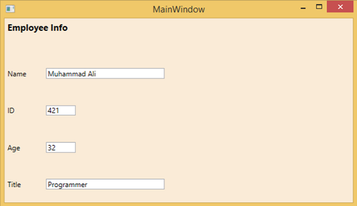

# WPF - Nesting of Layout
Nesting of layout means the use layout panel inside another layout, e.g. define stack panels inside a grid. This concept is widely used to take the advantages of multiple layouts in an application. In the following example, we will be using stack panels inside a grid.

Let’s have a look at the following XAML code.

```
<Window x:Class = "WPFNestingLayouts.MainWindow" 
   xmlns = "http://schemas.microsoft.com/winfx/2006/xaml/presentation" 
   xmlns:x = "http://schemas.microsoft.com/winfx/2006/xaml" 
   xmlns:d = "http://schemas.microsoft.com/expression/blend/2008" 
   xmlns:mc = "http://schemas.openxmlformats.org/markup-compatibility/2006" 
   xmlns:local = "clr-namespace:WPFNestingLayouts" 
   mc:Ignorable = "d" Title = "MainWindow" Height = "350" Width = "604">
	
   <Grid Background = "AntiqueWhite"> 
      <Grid.RowDefinitions> 
         <RowDefinition Height = "*" /> 
         <RowDefinition Height = "*" /> 
         <RowDefinition Height = "*" /> 
         <RowDefinition Height = "*" /> 
         <RowDefinition Height = "*" /> 
      </Grid.RowDefinitions> 
		
      <Grid.ColumnDefinitions> 
         <ColumnDefinition Width = "*" /> 
      </Grid.ColumnDefinitions> 
		
      <Label Content = "Employee Info" FontSize = "15"
         FontWeight = "Bold" Grid.Column = "0" Grid.Row = "0"/> 
			
      <StackPanel Grid.Column = "0" Grid.Row = "1" Orientation = "Horizontal"> 
         <Label Content = "Name"  VerticalAlignment = "Center" Width = "70"/> 
         <TextBox Name = "txtName" Text = "Muhammad Ali" VerticalAlignment = "Center"
            Width = "200">
         </TextBox> 
      </StackPanel>
		
      <StackPanel Grid.Column = "0" Grid.Row = "2" Orientation = "Horizontal"> 
         <Label Content = "ID" VerticalAlignment = "Center" Width = "70"/> 
         <TextBox Name = "txtCity" Text = "421" VerticalAlignment = "Center"
            Width = "50">
         </TextBox> 
      </StackPanel>
		
      <StackPanel Grid.Column = "0" Grid.Row = "3" Orientation = "Horizontal"> 
         <Label Content = "Age" VerticalAlignment = "Center" Width = "70"/> 
         <TextBox Name = "txtState" Text = "32" VerticalAlignment = "Center"
            Width = "50"></TextBox> 
      </StackPanel> 
		
      <StackPanel Grid.Column = "0" Grid.Row = "4" Orientation = "Horizontal"> 
         <Label Content = "Title" VerticalAlignment = "Center" Width = "70"/> 
         <TextBox Name = "txtCountry" Text = "Programmer" VerticalAlignment = "Center"
            Width = "200"></TextBox> 
      </StackPanel> 
		
   </Grid> 
	
</Window>
```
When you compile and execute the above code, it will produce the following window.



We recommend that you execute the above example code and try other nesting layouts.


[Previous Page](../wpf/wpf_layouts.md) [Next Page](../wpf/wpf_input.md) 
