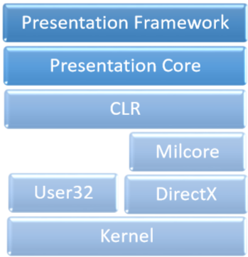

# WPF - Overview
WPF stands for Windows Presentation Foundation. It is a powerful framework for building Windows applications. This tutorial explains the features that you need to understand to build WPF applications and how it brings a fundamental change in Windows applications.

WPF was first introduces in .NET framework 3.0 version, and then so many other features were added in the subsequent .NET framework versions.

## WPF Architecture
Before WPF, the other user interface frameworks offered by Microsoft such as MFC and Windows forms, were just wrappers around User32 and GDI32 DLLs, but WPF makes only minimal use of User32. So,

   * WPF is more than just a wrapper.
   * It is a part of the .NET framework.
   * It contains a mixture of managed and unmanaged code.

The major components of WPF architecture are as shown in the figure below. The most important code part of WPF are −

   * Presentation Framework
   * Presentation Core
   * Milcore

The **presentation framework** and the **presentation core** have been written in managed code. **Milcore** is a part of unmanaged code which allows tight integration with DirectX (responsible for display and rendering). **CLR** makes the development process more productive by offering many features such as memory management, error handling, etc.

## WPF – Advantages
In the earlier GUI frameworks, there was no real separation between how an application looks like and how it behaved. Both GUI and behavior was created in the same language, e.g. C# or VB.Net which would require more effort from the developer to implement both UI and behavior associated with it.

In WPF, UI elements are designed in XAML while behaviors can be implemented in procedural languages such C# and VB.Net. So it very easy to separate behavior from the designer code.

With XAML, the programmers can work in parallel with the designers. The separation between a GUI and its behavior can allow us to easily change the look of a control by using styles and templates.

## WPF – Features
WPF is a powerful framework to create Windows application. It supports many great features, some of which have been listed below −

[Previous Page](../wpf/index.md) [Next Page](../wpf/wpf_environment_setup.md) 
