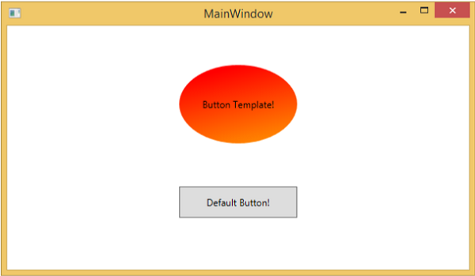
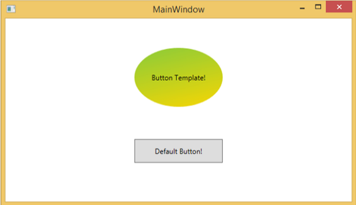
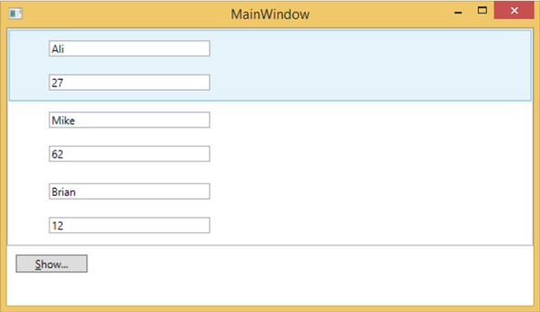

# WPF - Templates
A template describes the overall look and visual appearance of a control. For each control, there is a default template associated with it which gives the control its appearance. In WPF applications, you can easily create your own templates when you want to customize the visual behavior and visual appearance of a control.

Connectivity between the logic and the template can be achieved by data binding. The main difference between **styles** and **templates** are listed below −

   * Styles can only change the appearance of your control with default properties of that control.
   * With templates, you can access more parts of a control than in styles. You can also specify both existing and new behavior of a control.

There are two types of templates which are most commonly used −

   * Control Template
   * Data Template

## Control Template
The Control Template defines the visual appearance of a control. All of the UI elements have some kind of appearance as well as behavior, e.g., Button has an appearance and behavior. Click event or mouse hover event are the behaviors which are fired in response to a click and hover and there is also a default appearance of button which can be changed by the Control template.

### Example
Let’s take a simple example. We will create two buttons (one is with template and the other one is the default button) and initialize them with some properties.

```
<Window x:Class = "TemplateDemo.MainWindow" 
   xmlns = "http://schemas.microsoft.com/winfx/2006/xaml/presentation" 
   xmlns:x = "http://schemas.microsoft.com/winfx/2006/xaml" 
   Title = "MainWindow" Height = "350" Width = "604"> 
	
   <Window.Resources> 
      <ControlTemplate x:Key = "ButtonTemplate" TargetType = "Button">
		
         <Grid> 
            <Ellipse x:Name = "ButtonEllipse" Height = "100" Width = "150" > 
               <Ellipse.Fill> 
                  <LinearGradientBrush StartPoint = "0,0.2" EndPoint = "0.2,1.4"> 
                     <GradientStop Offset = "0" Color = "Red" /> 
                     <GradientStop Offset = "1" Color = "Orange" /> 
                  </LinearGradientBrush> 
               </Ellipse.Fill> 
            </Ellipse> 
				
            <ContentPresenter Content = "{TemplateBinding Content}" 
               HorizontalAlignment = "Center" VerticalAlignment = "Center" /> 
         </Grid> 
			
         <ControlTemplate.Triggers> 
			
            <Trigger Property = "IsMouseOver" Value = "True"> 
               <Setter TargetName = "ButtonEllipse" Property = "Fill" > 
                  <Setter.Value> 
                     <LinearGradientBrush StartPoint = "0,0.2" EndPoint = "0.2,1.4"> 
                        <GradientStop Offset = "0" Color = "YellowGreen" /> 
                        <GradientStop Offset = "1" Color = "Gold" /> 
                     </LinearGradientBrush> 
                  </Setter.Value> 
               </Setter> 
            </Trigger> 
				
            <Trigger Property = "IsPressed" Value = "True"> 
               <Setter Property = "RenderTransform"> 
                  <Setter.Value> 
                     <ScaleTransform ScaleX = "0.8" ScaleY = "0.8" 
                        CenterX = "0" CenterY = "0"  /> 
                  </Setter.Value> 
               </Setter> 
               <Setter Property = "RenderTransformOrigin" Value = "0.5,0.5" /> 
            </Trigger> 
				
         </ControlTemplate.Triggers> 
			
      </ControlTemplate> 
   </Window.Resources> 
	
   <StackPanel> 
      <Button Content = "Round Button!"
         Template = "{StaticResource ButtonTemplate}" 
         Width = "150" Margin = "50" /> 
      <Button Content = "Default Button!" Height = "40" 
         Width = "150" Margin = "5" />
   </StackPanel> 
	
</Window>
```
When you compile and execute the above code, it will display the following MainWindow.



When you move the mouse over the button with custom template, it will change its color as shown below.



## Data Template
A Data Template defines and specifies the appearance and structure of a collection of data. It provides the flexibility to format and define the presentation of the data on any UI element. It is mostly used on data related Item controls such as ComboBox, ListBox, etc.

### Example
   * Let’s take a simple example to understand the concept of data template. Create a new WPF project with the name **WPFDataTemplates**.
   * In the following XAML code, we will create a Data Template as resource to hold labels and textboxes. There is a button and a list box as well which to display the data.

```
<Window x:Class = "WPFDataTemplates.MainWindow" 
   xmlns = "http://schemas.microsoft.com/winfx/2006/xaml/presentation" 
   xmlns:x = "http://schemas.microsoft.com/winfx/2006/xaml" 
   xmlns:d = "http://schemas.microsoft.com/expression/blend/2008" 
   xmlns:mc = "http://schemas.openxmlformats.org/markup-compatibility/2006" 
   xmlns:local = "clr-namespace:WPFDataTemplates" 
   xmlns:loc = "clr-namespace:WPFDataTemplates" 
   mc:Ignorable = "d" Title = "MainWindow" Height = "350" Width = "525"> 
	
   <Window.Resources> 
      <DataTemplate DataType = "{x:Type loc:Person}"> 
		
         <Grid> 
            <Grid.RowDefinitions> 
               <RowDefinition Height = "Auto" /> 
               <RowDefinition Height = "Auto" /> 
            </Grid.RowDefinitions> 
				
            <Grid.ColumnDefinitions> 
               <ColumnDefinition Width = "Auto" /> 
               <ColumnDefinition Width = "200" /> 
            </Grid.ColumnDefinitions>
				
            <Label Name = "nameLabel" Margin = "10"/> 
            <TextBox Name = "nameText" Grid.Column = "1" Margin = "10" 
               Text = "{Binding Name}"/>  
            <Label Name = "ageLabel" Margin = "10" Grid.Row = "1"/> 
            <TextBox Name = "ageText" Grid.Column = "1" Grid.Row = "1" Margin = "10" 
               Text = "{Binding Age}"/> 
         </Grid> 
			
      </DataTemplate> 
   </Window.Resources> 
	
   <Grid> 
      <Grid.RowDefinitions> 
         <RowDefinition Height = "Auto" /> 
         <RowDefinition Height = "*" /> 
      </Grid.RowDefinitions> 
		
      <ListBox ItemsSource = "{Binding}" />  
      <StackPanel Grid.Row = "1" > 
         <Button Content = "_Show..." Click = "Button_Click" Width = "80" HorizontalAlignment = "Left" Margin = "10"/> 
      </StackPanel> 
		
   </Grid> 
	
</Window>
```
Here is **implementation in C#** in which a list of Person objects are assigned to DataContext, implementation of Person class and button click event.

```
using System.Collections.Generic; 
using System.Windows;
  
namespace WPFDataTemplates { 

   public partial class MainWindow : Window { 
	
      Person src = new Person { Name = "Ali", Age = 27 }; 
      List<Person> people = new List<Person>(); 
		
      public MainWindow() { 
         InitializeComponent(); 
         people.Add(src); 
         people.Add(new Person { Name = "Mike", Age = 62 }); 
         people.Add(new Person { Name = "Brian", Age = 12 });  
         this.DataContext = people; 
      } 
		
      private void Button_Click(object sender, RoutedEventArgs e) { 
         string message = src.Name + " is " + src.Age; 
         MessageBox.Show(message); 
      } 
   } 
	
   public class Person { 
      private string nameValue; 
		
      public string Name { 
         get { return nameValue; } 
         set { nameValue = value; } 
      }  
		
      private double ageValue; 
		
      public double Age { 
         get { return ageValue; } 
         set { 
            if (value != ageValue) { 
            ageValue = value; 
            } 
         } 
      } 
   } 
	
}
```
When you compile and execute the above code, it will produce the following window. It contains one list and inside the list box, each list box item contains the Person class object data which are displayed on Labels and Text boxes.




[Previous Page](../wpf/wpf_resources.md) [Next Page](../wpf/wpf_styles.md) 
