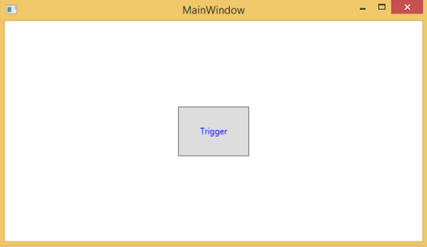
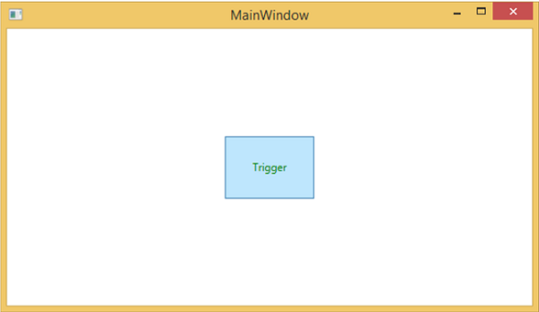
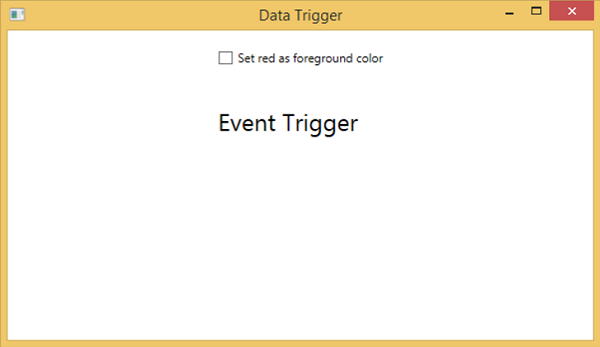
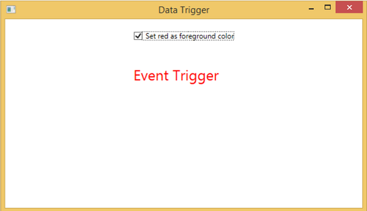
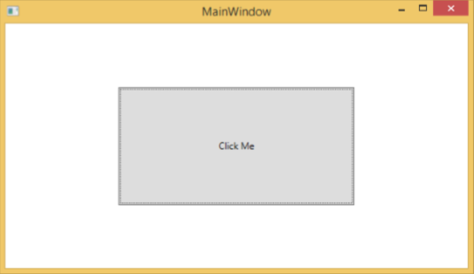

# WPF - Triggers
A trigger basically enables you to change property values or take actions based on the value of a property. So, it allows you to dynamically change the appearance and/or behavior of your control without having to create a new one.

Triggers are used to change the value of any given property, when certain conditions are satisfied. Triggers are usually defined in a style or in the root of a document which are applied to that specific control. There are three types of triggers −

   * Property Triggers
   * Data Triggers
   * Event Triggers

## Property Triggers
In property triggers, when a change occurs in one property, it will bring either an immediate or an animated change in another property. For example, you can use a property trigger to change the appearance of a button when the mouse hovers over the button.

The following example code shows how to change the foreground color of a button when mouse hovers over the button.

```
<Window x:Class = "WPFPropertyTriggers.MainWindow" 
   xmlns = "http://schemas.microsoft.com/winfx/2006/xaml/presentation" 
   xmlns:x = "http://schemas.microsoft.com/winfx/2006/xaml" 
   Title = "MainWindow" Height = "350" Width = "604"> 
	
   <Window.Resources> 
      <Style x:Key = "TriggerStyle" TargetType = "Button"> 
         <Setter Property = "Foreground" Value = "Blue" /> 
         <Style.Triggers> 
            <Trigger Property = "IsMouseOver" Value = "True"> 
               <Setter Property = "Foreground" Value = "Green" /> 
            </Trigger> 
         </Style.Triggers> 
      </Style> 
   </Window.Resources> 
	
   <Grid> 
      <Button Width = "100" Height = "70"
         Style = "{StaticResource TriggerStyle}" Content = "Trigger"/> 
   </Grid> 
	
</Window>
```
When you compile and execute the above code, it will produce the following window −



When the mouse hovers over the button, its foreground color will change to green.



## Data Triggers
A data trigger performs some actions when the bound data satisfies some conditions. Let’s have a look at the following XAML code in which a checkbox and a text block are created with some properties. When the checkbox is checked, it will change its foreground color to red.

```
<Window x:Class = "WPFDataTrigger.MainWindow" 
   xmlns = "http://schemas.microsoft.com/winfx/2006/xaml/presentation" 
   xmlns:x = "http://schemas.microsoft.com/winfx/2006/xaml" 
   Title = "Data Trigger" Height = "350" Width = "604">
	
   <StackPanel HorizontalAlignment = "Center"> 
      <CheckBox x:Name = "redColorCheckBox" 
         Content = "Set red as foreground color" Margin = "20"/> 
			
      <TextBlock Name = "txtblock" VerticalAlignment = "Center" 
         Text = "Event Trigger" FontSize = "24" Margin = "20"> 
         <TextBlock.Style> 
            <Style> 
               <Style.Triggers> 
                  <DataTrigger Binding = "{Binding ElementName = redColorCheckBox, Path = IsChecked}" 
                     Value = "true"> 
                     <Setter Property = "TextBlock.Foreground" Value = "Red"/> 
                     <Setter Property = "TextBlock.Cursor" Value = "Hand" /> 
                  </DataTrigger> 
               </Style.Triggers> 
            </Style> 
         </TextBlock.Style> 
      </TextBlock> 
		
   </StackPanel> 
	
</Window>
```
When the above code is compiled and executed, it will produce the following output −



When you tick the checkbox, the text block will change its foreground color to red.



## Event Triggers
An event trigger performs some actions when a specific event is fired. It is usually used to accomplish some animation on control such DoubleAnumatio, ColorAnimation, etc. In the following example, we will create a simple button. When the click event is fired, it will expand the button width and height.

```
<Window x:Class = "WPFEventTrigger.MainWindow"
   xmlns = "http://schemas.microsoft.com/winfx/2006/xaml/presentation" 
   xmlns:x = "http://schemas.microsoft.com/winfx/2006/xaml" 
   Title = "MainWindow" Height = "350" Width = "604"> 
	
   <Grid> 
      <Button Content = "Click Me" Width = "60" Height = "30">
		
         <Button.Triggers> 
            <EventTrigger RoutedEvent = "Button.Click"> 
               <EventTrigger.Actions> 
                  <BeginStoryboard> 
                     <Storyboard> 
							
                        <DoubleAnimationUsingKeyFrames Storyboard.TargetProperty = 
                           "Width" Duration = "0:0:4"> 
                           <LinearDoubleKeyFrame Value = "60" KeyTime = "0:0:0"/> 
                           <LinearDoubleKeyFrame Value = "120" KeyTime = "0:0:1"/> 
                           <LinearDoubleKeyFrame Value = "200" KeyTime = "0:0:2"/> 
                           <LinearDoubleKeyFrame Value = "300" KeyTime = "0:0:3"/> 
                        </DoubleAnimationUsingKeyFrames>
								
                        <DoubleAnimationUsingKeyFrames Storyboard.TargetProperty = "Height" 
                           Duration = "0:0:4"> 
                           <LinearDoubleKeyFrame Value = "30" KeyTime = "0:0:0"/> 
                           <LinearDoubleKeyFrame Value = "40" KeyTime = "0:0:1"/> 
                           <LinearDoubleKeyFrame Value = "80" KeyTime = "0:0:2"/> 
                           <LinearDoubleKeyFrame Value = "150" KeyTime = "0:0:3"/> 
                        </DoubleAnimationUsingKeyFrames>
								
                     </Storyboard> 
                  </BeginStoryboard> 
               </EventTrigger.Actions> 
            </EventTrigger> 
         </Button.Triggers> 
			
      </Button> 
   </Grid> 
	
</Window>
```
When you compile and execute the above code, it will produce the following window −


Upon clicking the button, you will observe that it will start expanding in both dimensions.



We recommend that you compile and execute the above examples and apply the triggers to other properties as well.


[Previous Page](../wpf/wpf_styles.md) [Next Page](../wpf/wpf_debugging.md) 
